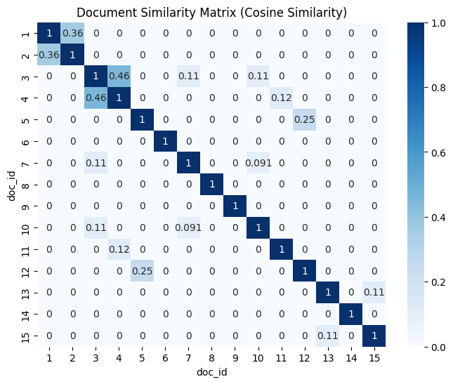

# 📄 Document Similarity Finder

This project finds the **most similar documents** in a dataset using **TF-IDF** and **cosine similarity**.

---

## 📝 Description
- Take a dataset of documents (news articles, essays, research abstracts, etc.)
- Preprocess the text (tokenization, stopword removal, lemmatization)
- Represent documents with TF-IDF vectors
- Compute cosine similarity between all pairs
- Identify top 3 most similar document pairs

---

## 📂 Dataset
- Example dataset: `documents.csv`  
- Columns:
  - `doc_id`: unique ID for each document
  - `text`: content of the document

- Sample data:
doc_id,text
1,"The stock market crashed yesterday due to economic uncertainty."
2,"Yesterday, the economy faced a downturn as the stock market fell."
3,"A new species of bird was discovered in the Amazon rainforest."

---

## ⚙️ Environment
- Python 3.x (Colab recommended)
- Libraries:
  - pandas
  - numpy
  - nltk
  - scikit-learn
  - matplotlib
  - seaborn

---

## 🚀 How to Run
1. Upload `documents.csv` to Colab  
2. Run preprocessing:
   - Lowercase  
   - Remove punctuation  
   - Remove stopwords  
   - Lemmatization  
3. Convert documents to TF-IDF vectors  
4. Compute cosine similarity matrix  
5. Visualize similarity matrix with a heatmap  
6. Find top 3 most similar document pairs  

---

## 📊 Deliverables
- **Similarity matrix** (heatmap)  
- **Top 3 most similar document pairs**  

---

## 🖼️ Example Output

**Top 3 Most Similar Document Pairs:**
Document 3 & Document 4 → Similarity: 0.4580
Document 4 & Document 3 → Similarity: 0.4580
Document 1 & Document 2 → Similarity: 0.3612

**Similarity Matrix Heatmap:**  

---

## 🛠️ Notes
- Self-similarity (document with itself) is ignored when finding top pairs  
- Larger datasets will provide more meaningful results  
- Can be extended to:
  - Detect plagiarism in essays
  - Cluster similar news articles
  - Suggest related research papers

